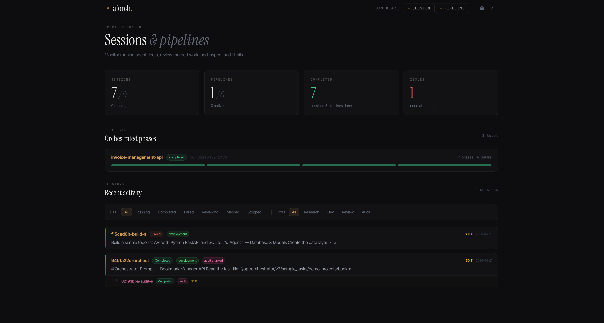
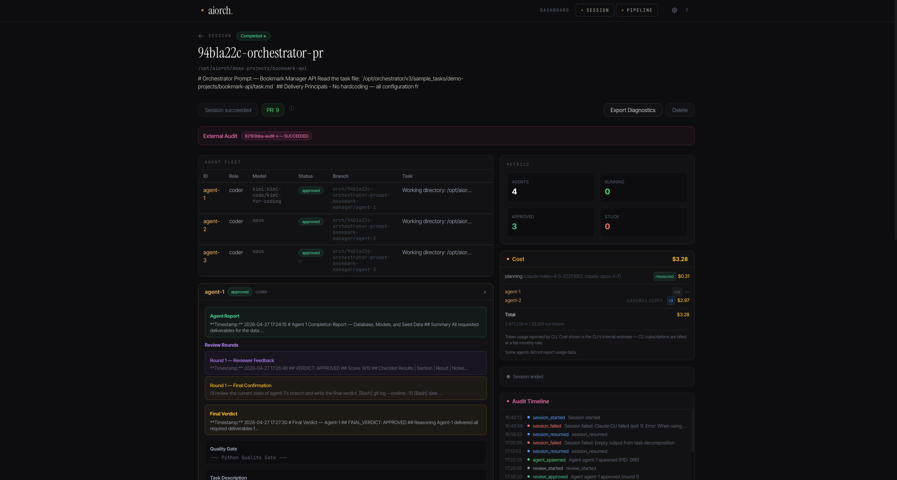
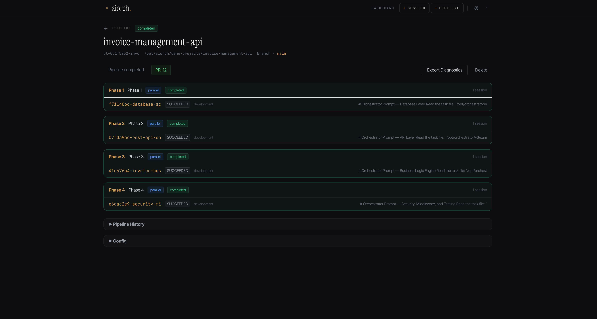

# AIORCH

**Parallel AI agents that ship _reviewed_ pull requests.**

AIORCH decomposes a single task across multiple coding agents, makes them review each other's work in rounds, resolves conflicts, and delivers a single GitHub PR ready for human review. Runs entirely on your infrastructure. Your model keys. Your code. Zero markup.



## Why AIORCH

Most coding tools give you code. AIORCH gives you a _reviewed_ PR — so humans review reviewed code, not draft code.

- **Cross-provider routing** — Claude Code only orchestrates Claude. Codex only OpenAI. AIORCH routes per-agent across Claude, OpenAI, Kimi, Codex, and Ollama in a single session.
- **Plan review checkpoint** — after task decomposition, the session pauses so you can inspect, edit, add, or remove agents before a single token is spent on execution. Approve when ready, or reject with feedback to re-plan.
- **Three review layers** — an in-loop reviewer agent, an independent external auditor, and integration verification. Three checkpoints between prompt and merge button.
- **Pipelines, not just tasks** — multi-phase work (refactor schema → migrate callers → update tests → deprecate API). Sessions of 60+ agents across 10+ phases run unattended.
- **BYOK, zero markup** — bring your own API keys, pay providers directly at list price.
- **Self-hosted** — Docker container on your infrastructure, no outbound data.

## How It Works

Six stages, one command, one PR.

1. **Decompose** — Your task is parsed into isolated subtasks with explicit scope and acceptance criteria.
2. **Review the plan** — The session pauses and presents the agent plan for your approval. Add, remove, or edit agents, rename tasks, adjust dependencies — then approve to continue. Skip this step per-session or globally with `ORCH_AUTO_APPROVE_PLAN`. Pipeline sessions auto-approve for unattended operation.
3. **Fan out** — Each subtask gets its own agent, git worktree, and model. Agents run in parallel, in isolation.
4. **Review** — A dedicated reviewer agent critiques each output and demands revisions until the work meets spec.
5. **Merge** — Branches merge into an integration branch. Conflicts resolve programmatically or escalate.
6. **Deliver** — A single GitHub PR lands with summary, diff stats, agent breakdown, and full event log.



## Install

```bash
curl -fsSL https://aiorch.ai/install.sh | bash
```

Requires Docker. Takes under 5 minutes. Works on Ubuntu 22.04/24.04 and any Linux with Docker.

The installer:
- Checks Docker and Docker Compose
- Pulls the AIORCH image (Claude CLI and Codex CLI bundled)
- Prompts for port, license key, and configuration
- Generates config and starts the service

Open `http://localhost:1230` to access the dashboard.

## First Steps

1. Visit `/settings` to set your master password and configure API keys.
2. Click `+ Session` to create your first orchestration session.
3. Enter a task description, select your project directory, choose models per role.
4. Start the session and watch agents work in real time.
5. When complete, click "Create GitHub PR" to push results.

## Supported Models

| Provider | How it runs | Agent work | Planning | Review |
|---|---|:-:|:-:|:-:|
| **Claude** | Claude CLI (bundled) | Yes | Yes | Yes |
| **OpenAI** | API + Codex CLI (bundled) | Yes | Yes | Yes |
| **Kimi** | API | Yes | Yes | Yes |
| **Ollama** | Local, any tool-capable model | Yes\* | Yes | Yes |

\* Ollama agent work requires a tool-capable model. Browse models at [ollama.com/search?c=tools](https://ollama.com/search?c=tools).

Mix models per role: cheap model for planning, strong model for coding, balanced model for review. Model dropdowns are populated dynamically from live provider health probes — only available, tested models appear.

### Smart Model Routing

The planning model classifies each subtask as high, medium, or low difficulty, then each agent runs on the model configured for its tier.

- **High** (architecture, complex algorithms, security) → Opus, GPT-5.5
- **Medium** (feature implementation, APIs, services) → Sonnet, GPT-5.4
- **Low** (boilerplate, config, simple tests) → Haiku, Ollama local

Mix providers freely — Claude for hard tasks, OpenAI for medium, Ollama for simple, all in one session running in parallel. Toggle on/off per session via the dashboard.

## Pipelines

For work that doesn't fit a single task, AIORCH runs **pipelines** — sequential phases where each phase fans out to multiple agents and the next phase waits on the previous. A real session: 11 phases, 61 agents, all merged automatically.

Use it when one prompt isn't enough — schema refactors, multi-service migrations, codebase-wide deprecations.



## Features

- Plan review checkpoint — approve, edit, or reject the agent plan before execution begins; reject with feedback to re-plan automatically
- Cross-provider smart routing — difficulty-based model assignment, mix Claude/OpenAI/Kimi/Codex/Ollama in one session
- Multi-phase pipelines with dependency-aware ordering
- Three review layers: reviewer agent, external auditor, integration verification
- Real-time web dashboard with SSE streaming and token-by-token agent output
- Per-agent cost tracking (measured for API, estimated for CLI, free for Ollama)
- GitHub PR auto-creation with summary, cost breakdown, and diff stats
- Append-only JSONL audit log per session — every event, on disk
- Git worktree isolation per agent — full filesystem isolation, not just branches
- Automatic build artifact cleanup — `target/`, `node_modules/`, `build/`, `.gradle/` removed when agents finish; prevents disk fill in parallel sessions for compiled languages
- Agent resilience — auto-retry, timeout detection, zombie recovery, one-click restart
- Diagnostic export for remote support
- Master-password-protected settings page for API key management

## Security

- **Dashboard authentication** — API key auto-generated on install, required for all API requests
- **Rate limiting** — 120 requests/minute per IP, configurable via `ORCH_RATE_LIMIT_RPM`
- **API keys at rest** — encrypted with machine-bound Fernet, managed via master-password-protected settings
- **All API responses sanitized** — regex patterns strip secrets from output
- **Agent subprocesses** run with sensitive env vars stripped
- **Tool-use loop sandboxed** — path validation, command blocking, symlink escape prevention
- **Pre-review hooks** scan for hardcoded secrets in code diffs
- **Non-root Docker** — services run as unprivileged users
- **Timing-safe auth** — API key comparison uses constant-time algorithm
- **Self-hosted** — code and keys stay on your infrastructure

## Pricing

Named-user licenses. Each seat is bound to one email and can be installed on unlimited devices by that user.

| Plan | Price | Notes |
|---|---|---|
| **Free trial** | Free for 14 days | Full features, no card, no commitment |
| **Team** | $39 / seat / month | Minimum 3 seats. Billed monthly or annually (2 months free with annual) |
| **Enterprise** | Custom | SSO + audit logs, custom routing, dedicated success manager, custom terms |

All inference is billed by your model provider at list price, directly to you. AIORCH adds zero token markup.

See [aiorch.ai/#pricing](https://aiorch.ai/#pricing) for current pricing and to start the trial.

## Roadmap

- **In progress** — Signed event log (hash-chained, SHA-256-signed) for tamper-evident replay
- **Planned (Q3)** — Policy & model allowlists (YAML for constraining models, repos, branches, spend caps)
- **Considering** — Multi-user / shared history (would require a hosted backend; single-user by design today)

## Requirements

- Docker 20.10+
- Docker Compose v2
- API keys for the providers you use (Claude, OpenAI, Kimi)
- Optional: Ollama for local models

The Claude CLI and Codex CLI are bundled in the AIORCH image — no host install needed.

## Support

- **Email:** support@aiorch.ai
- **Issues:** Open an issue in this repository
- **Diagnostics:** Use the "Export Diagnostics" button on the session page to generate a sanitized report

## Links

- **Website:** [aiorch.ai](https://aiorch.ai)
- **Install:** `curl -fsSL https://aiorch.ai/install.sh | bash`
