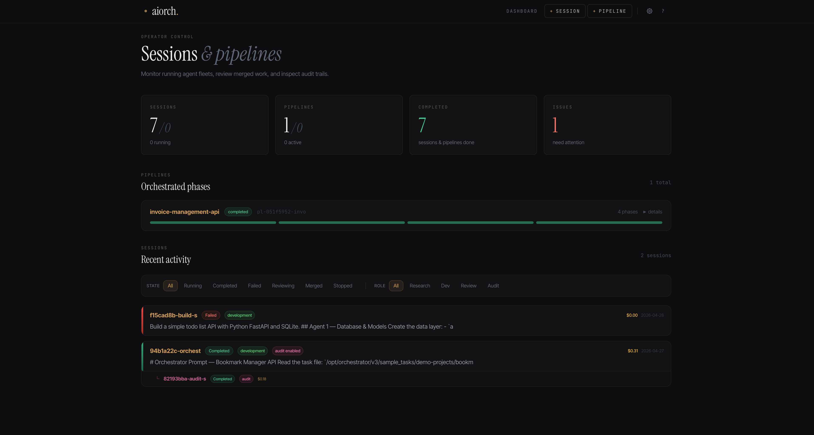

# AiOrch

**Self-hosted coding agent orchestration. Engineering. Orchestrated.**

AiOrch turns Claude Code, Codex and other coding agents into an engineering pipeline: plan a task, implement in parallel, review revisions, integrate branches and optionally deliver a GitHub pull request for human review.

The orchestrator, git worktrees and session state run on your infrastructure. Configured model providers receive the context needed for inference. License activation/validation and optional GitHub delivery have separate connections. You bring your own provider accounts; AiOrch adds no token markup.

[Website](https://aiorch.ai/) · [Documentation](https://aiorch.ai/docs/) · [Current pricing and roadmap](https://aiorch.ai/#pricing)



## Start with a real task

The current Docker installer requires a Linux host, Docker, Docker Compose and an interactive terminal. Run as a non-root operator with Docker access:

```bash
curl -fsSL https://aiorch.ai/install.sh | bash
```

You can [inspect the installer](install.sh) first. It prompts for the installation directory, port, private host interface, license and image. The default dashboard is local-only at `http://localhost:1230`. Remote access requires deliberately configured private access and appropriate TLS termination.

Follow the [installation and first-session guide](https://aiorch.ai/docs/getting-started/) for provider setup, project mounts and agent permission requirements. Headless CLI execution requires explicit opt-in after verifying narrow mounts and acceptable permissions. Git worktrees separate working copies; they are not a security sandbox.

## Models and workflow

- CLI integrations for Claude Code, Codex and Kimi; OpenAI API integration; local inference through Ollama.
- Separate model choices for planning, implementation and review; configurable difficulty-based routing.
- Proposed agent scopes and dependencies, with a plan approval checkpoint unless auto-approval is enabled.
- Parallel worktrees and a reviewer/revision loop.
- Configurable branch integration, remote push, independent audit and GitHub PR creation.
- Operator-declared integration command or detected compile gates. The environment failure policy can deliver an explicitly unverified result in advisory mode, or block delivery in strict mode.
- Local session state and event history, with resumable workflows.

Model availability and tool capability depend on the configured provider and installed release. Inference costs and rate limits come from the chosen provider. Human review and the repository's normal CI gates still apply.

## Documentation

- [Installation](https://aiorch.ai/docs/getting-started/)
- [Provider configuration](https://aiorch.ai/docs/providers/)
- [Architecture, data flow and agent boundaries](https://aiorch.ai/docs/architecture/)
- [Code review, integration tests and PR delivery](https://aiorch.ai/docs/review-and-validation/)
- [Parallel coding agents with git worktrees](https://aiorch.ai/guides/parallel-coding-agents/)

## Website repository

This public repository contains the marketing website, customer documentation, installer and existing public media. The static website is deployed by the existing Cloudflare Pages project `aiorch-public` from `main`; changes use the protected-branch PR workflow. No frontend build or framework is required.

Use `python3 -m http.server 8787 --bind 127.0.0.1` for a local preview. Cloudflare Pages serves `.html` files through extensionless routes; the local Python server can open those files explicitly. Run `python3 tools/verify_site.py` for link, discovery and metadata checks.

Contact: [tech@aiorch.ai](mailto:tech@aiorch.ai).
